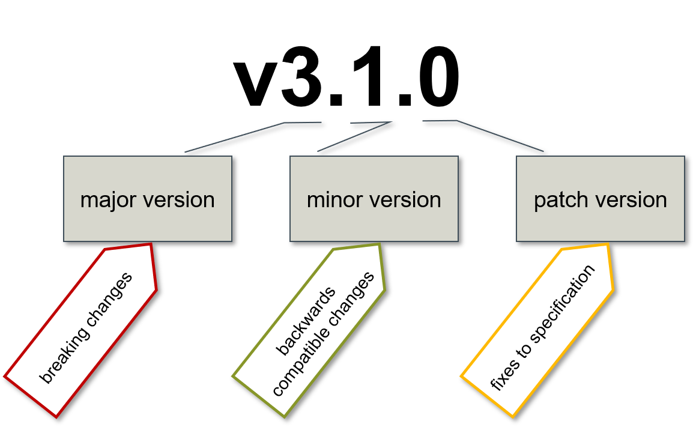

# T8-javascript-IV
Turma 8 | Front-end | 2019 | Semana 13 | Javascript IV


> Nessa semana revisaremos o conteúdo de javascript pré react.

---

### [Aula 1](#aula-1)
#### Resumo
Nessa aula vimos:
* [Git-flow](#git-flow)
* [Array](#array)
* [Exercícios](#exercicios)
* [Conteúdo para estudo](#conteúdo-para-estudo)

## Aula 1
#### Git flow
É um dos modelos existentes para organizar branches.
Tendo como principio: 
- Branch master -> Onde temos o código de produção, com a versão mais estável
- Branch develop -> Código em teste, sendo a etapa pré produção, só mandando para a master quando estiver estável.
- Branch feature/funcionalidade -> Criadas a partir da develop, são branches criadas com o objetivo de entregar 'tarefas', como por exemplo uma branch em que você mexe só no menu.
- Branch hotfix -> Branches para correção de bugs críticos
- Branch release -> branch para lançamento de código na master, essas duas costumam gerar tags.


O primeiro número da esquerda para a direita são mudanças grandes que podem pedir que sistemas dependentes se atualizem, sendo a major version, o segundo é a minor, que são modificações que ainda suportam o código antigo e o terceiro é a minor que são correção de bugs

Em aula executamos a criação da develop e fizemos a branch da aula como se fosse uma feature branch, além de solicitar um Pull Request(PR)

```
git clone {repo-novo}
```
Vocês criaram um repositorio no github com a opção de README.md e clonaram. Depois adicionaram um remote desse reposito da reprograma para pegar os arquivos de exercícios:
```
git remote add upstream https://github.com/reprograma/T8-javascript-IV.git
git fetch --all
```
Para vermos se o remote está correto fazemos: 
```
git remote -v
```


Caso queira mudar o repositorio de algum dos remotes é só fazer
```
git ${nome dado ao remote} set-url origin ${url de clone}
```
No nosso caso os valores aceitos para ${nome dado ao remote} são `origin` e `upstream` 

Para criar a develop local e depois mandar para o repositorio online fazemos:
```
git checkout -b develop origin/master
git push origin develop
git branch -a //para listar
```
Para criar a feature branch local e depois mandar para o repositorio online fazemos:
```
git checkout -b aula1 origin/develop
git commit -m "[Aula1] Revisão Array e Object" --allow-empty
git push origin aula1 
```
Para pegar arquivos que estão no repositorio da reprograma:
```
git merge upstream/aula1 --allow-unrelated-histories 
```
E resolver os conflitos.
Durante as aulas fomos atualizando nosso remoto com
```
git add .
git commit -m "${informação sobre o andamento da aula}"
git push origin aula1
```
E ao final fizemos o processo de Pull Request pelo github


#### Array
- Utilizamos como base dois repositorios da Reprograma para essa revisão: 
- [Reprograma T7 - Javascript III por Bruna Vieira](https://github.com/reprograma/T7-JavaScript-III)
- [Reprograma T7 - Javascript IV por Laís Lima](https://github.com/reprograma/t7-javascript-IV/tree/master/aula01-arrays)

**Principais Métodos**
* [**concat**](https://developer.mozilla.org/en-US/docs/Web/JavaScript/Reference/Global_Objects/Array/concat) faz cópia simples do Array e adiciona os argumentos 
* [**join**](https://developer.mozilla.org/en-US/docs/Web/JavaScript/Reference/Global_Objects/Array/join) cria um string do Array. Adiciona o argumento como cola entre cada membro do Array. 
* [**shift**](https://developer.mozilla.org/en-US/docs/Web/JavaScript/Reference/Global_Objects/Array/shift) remove e retorna o primeiro elemento 
* [**pop**](https://developer.mozilla.org/en-US/docs/Web/JavaScript/Reference/Global_Objects/Array/pop) remove e retorna o ultimo elemento 
* [**unshift**](https://developer.mozilla.org/en-US/docs/Web/JavaScript/Reference/Global_Objects/Array/unshift) anexa os argumentos na frente do Array  
* [**push**](https://developer.mozilla.org/en-US/docs/Web/JavaScript/Reference/Global_Objects/Array/push) anexa os argumentos no final do Array  
* [**reverse**](https://developer.mozilla.org/en-US/docs/Web/JavaScript/Reference/Global_Objects/Array/reverse) inverte o Array sem copiá-lo 
* [**slice**](https://developer.mozilla.org/en-US/docs/Web/JavaScript/Reference/Global_Objects/Array/slice) faz cópia simples da porção do Array delimitada por argumentos do índice 
* [**splice**](https://developer.mozilla.org/en-US/docs/Web/JavaScript/Reference/Global_Objects/Array/splice) remove elementos especificados do Array, e os substitui com argumentos adicionais opcionais 
* [**sort**](https://developer.mozilla.org/en-US/docs/Web/JavaScript/Reference/Global_Objects/Array/sort) classifica o Array sem copiá-lo, opcionalmente usando um argumento comparador 
* [**toString**](https://developer.mozilla.org/en-US/docs/Web/JavaScript/Reference/Global_Objects/Array/toString) chama join sem passar um argumento
* [**indexOf**](https://developer.mozilla.org/en-US/docs/Web/JavaScript/Reference/Global_Objects/Array/indexOf) retorna o primeiro elemento igual ao valor especificado, ou -1 *se nenhum for encontrado 
* [**lastIndexOf**](https://developer.mozilla.org/en-US/docs/Web/JavaScript/Reference/Global_Objects/Array/lastIndexOf) retorna o último elemento igual ao valor especificado, ou -1 se nenhum for encontrado 
* [**forEach**](https://developer.mozilla.org/en-US/docs/Web/JavaScript/Reference/Global_Objects/Array/forEach) aplica a função fornecida para todos elementos do Array
* [**map**](https://developer.mozilla.org/en-US/docs/Web/JavaScript/Reference/Global_Objects/Array/map) cria um novo Array contendo os resultados da aplicação da função a todos elementos do Array 
* [**filter**](https://developer.mozilla.org/en-US/docs/Web/JavaScript/Reference/Global_Objects/Array/filter) cria um novo Array contendo todos os elementos para os quais a função fornecida retorna verdadeiro 
* [**reduce**](https://developer.mozilla.org/en-US/docs/Web/JavaScript/Reference/Global_Objects/Array/lastIndexOf) aplica uma função simultaneamente para dois valores do Array (da esquerda para a direita) de forma a reduzi-los a um valor único
* [**some**](https://developer.mozilla.org/en-US/docs/Web/JavaScript/Reference/Global_Objects/Array/some) Checa se pelo menos um dos elementos do array obedece a condição passada pela função
* [**every**](https://developer.mozilla.org/en-US/docs/Web/JavaScript/Reference/Global_Objects/Array/every) Checa se todos os elementos do array obedecem a condição passada pela função 

#### Exercicios
- [Exercicio1](array/ex1)
- [Exercicio2](array/ex2)

#### Conteúdo para estudo
- [Documentação mozilla](https://developer.mozilla.org/en-US/docs/Web/JavaScript/Reference/Global_Objects/Array/prototype)
- [Git flow - github](https://datasift.github.io/gitflow/IntroducingGitFlow.html)
- [Git flow - gitlab](https://docs.gitlab.com/ee/workflow/gitlab_flow.html)
- [Git flow - bitbucket](https://br.atlassian.com/git/tutorials/comparing-workflows/gitflow-workflow)
>>>>>>> upstream/aula2
